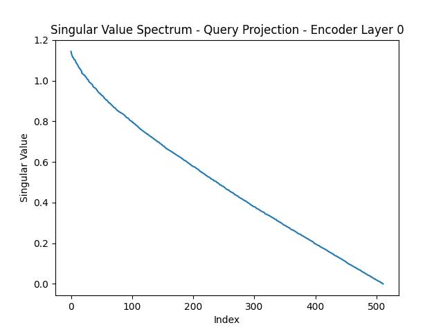

# informer_2020

task to be done : 

# load informer model --> take 1 layer --> take its weight matrix --> get singular values and plot them 

### this can be done with the help of weightwatcher 

explaining the importance of weighwatcher is bascially extract wieghts 

### extracting model

'''python
model = Informer(enc_in=7, dec_in=7, c_out=7, seq_len=96, label_len=48, out_len=24, factor=5, d_model=512, n_heads=8, e_layers=2, d_layers=1, d_ff=2048, dropout=0.0, attn='prob', embed='fixed', freq='h', activation='gelu', output_attention=False, distil=True)
print(model)

exact understanding 
informer : some niche version of transformer where probsparse attention mech is used 
weight watcher : comparing power law based alpha showing bulk and singular values as well as the models performance without actually training it 

use of wightwatcher : either for deeper understanding of mathematical concepts wihtout actually implementing the training anf testing eventually saving time and cost 
or evaluating the blackbox and layer by layer assumption to check which layer can produce unacceptable outputs 

what is prob sparse attention ? 
distinction of top k querires and their relation with all key -value so context becomes small but retains the importance and classfiying the lazy queries with approximations 

choice of encoder layer or matrix to show 
: mostly query and value 
as this is where informer has difference from normal self-attentiona dn multi-head attention 

what does SVD ?
very importent of a matrix it shows us the force or expansion in a partocular direction 
importance of that direction in output 

